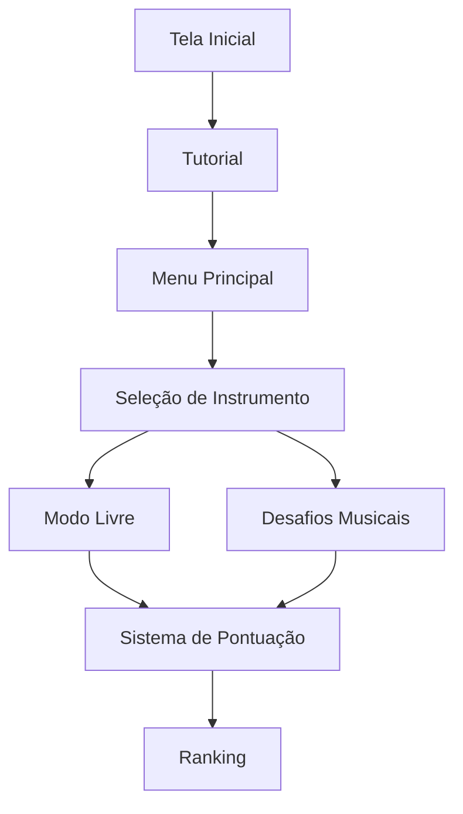
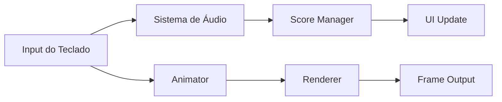

# 🎼 Maestro em Treino

## 📌 Informações Gerais 
| **Universidade** | Universidade do Algarve (UALG) | 
|-----------------|-------------------------------|
| **Unidade Curricular** | Computação Gráfica |
| **Docente** | Prof. Sérgio Manuel Machado Jesus |
| **Grupo** | 15 |
| **Entrega** | 26 de maio de 2025 |

---

## 🎯 1. Introdução  
O *Maestro em Treino* é um jogo musical em que o jogador controla Joãozinho em um mundo fantástico, tocando 4 instrumentos tradicionais para conquistar o público.  

**Destaques:**  
- Ambiente 3D imersivo  
- Sistema de pontuação baseado em combinações musicais  
- 4 instrumentos com mecânicas únicas  

---

## 🎮 2. Fluxo do Jogo  


---

## 🛠 3. Stack Tecnológica  

### 📊 Arquitetura do Sistema  
| Módulo          | Tecnologias                          | Finalidade                     |
|-----------------|--------------------------------------|--------------------------------|
| Renderização    | OpenGL, Blender                      | Modelos 3D e animações         |
| Áudio           | PyAudio, custom WAV loader           | Efeitos sonoros e música       |
| Física          | NumPy (matrizes/quaternions)         | Transformações e colisões      |
| UI              | OpenGL Immediate Mode                | Menus e HUD                    |

### 📁 Estrutura de Arquivos  
```
├── core/              # Funções base (matrizes, loaders)
├── core_ext/          # Scene, Camera, Mesh
├── extras/            # Utilitários (grade, eixos)
├── geometry/          # Primitivas 3D
├── assets/            # Modelos/texturas/áudio
└── main.py            # Ponto de entrada
```

---

## 🎻 4. Instrumentos & Mecânicas  

| Instrumento    | Teclas    | Notas       | Dificuldade | 
|---------------|----------|-------------|-------------|
| Harmónica     | Q W E R   | Dó-Ré-Mi-Fá | ★★☆         |
| Triângulo     | T Y U I   | Lá-Sol      | ★☆☆         |
| Gaita de Foles| A S D F   | Si-Dó#      | ★★★         |
| Concertina    | Z X C V   | Ré-Mi-Fá#   | ★★☆         |

**Sistema de Pontuação:**  
- Acerto consecutivo: +100pts (combo)   

---

## � 5. Desafios & Soluções  

| Desafio                     | Solução Adotada                | 
|-----------------------------|--------------------------------|
| Animação do acordeão        | Keyframes programáticas        |
| Síntese de áudio            | Amostras reais processadas     |
| Público virtual             | Sprites animados               |
| Otimização de performance   | LOD (Level of Detail)          |

---

## 📈 6. Fluxograma Técnico  

## 🕒 7. Cronograma  
| Fase           | Duração   | Entregáveis                  |
|----------------|-----------|------------------------------|
| Prototipagem   | 2 semanas | Modelos base, engine gráfica |
| Implementação  | 3 semanas | Todos os instrumentos        |
| Polimento      | 1 semana  | Efeitos sonoros, UI          |

---

## 👥 Membros do Grupo  
| Número | Nome           | Contribuição Principal |
|--------|----------------|------------------------|
| a80041 | Afonso Sousa   | Modelagem 3D/Áudio     |
| a80044 | Tomás Teodoro  | Programação OpenGL     |
| a76920 | Tiago Antunes  | Lógica do Jogo         |
| a90985 | Thomaz Lima    | Animação/UI            |
